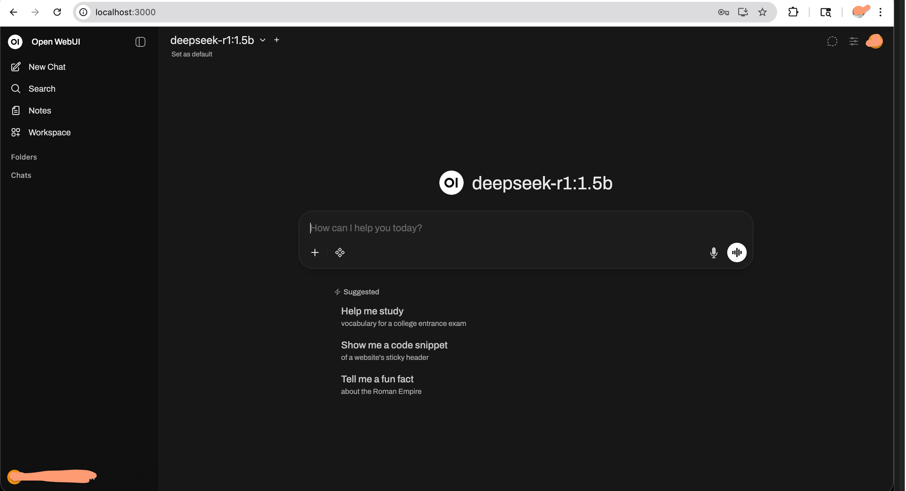

## 🚀 Local AI Chatbot Setup Guide

A complete guide to setting up your own ChatGPT-like interface running locally on your Mac using Ollama and Open WebUI.

## 📋 What You'll Build

By following this guide, you'll have:
-  Ollama running locally on your Mac
-  A beautiful web interface(Open WebUI) to chat with your AI.
-  Complete privacy- everything runs on your machine!

## 🎯 Prerequisites
- Mac (works on both Intel and Apple Silicon M1/M2/M3)
- 8GB+ RAM (16GB recommended)
- 10GB+ free disk space (for models)
- Internet connection (for initial setup)

## 📦 Part 1: Install Ollama
### Step 1: Download Ollama
- Visit https://ollama.com/download
- Click "Download for macOS"
- Open the downloaded .dmg file
- Drag Ollama to your Applications folder
- Open Ollama from Applications

### Step 2: Verify Installation
Open Terminal and run:

```ollama --version```

You should see the version number ```(e.g., ollama version 0.x.x)```

## 🤖 Part 2: Download Your First LLM
### Step 1: Download a Model

```ollama pull deepseek-r1:7b```

### Step 2: Test Your Model

```ollama run deepseek-r1:7b```

You should see a chat interface! Try asking: ```Hello, how are you?```

To exit, type:``` /bye```

## 🐳 Part 3: Install Docker Desktop
- Visit https://www.docker.com/products/docker-desktop
- Click "Download for Mac"
- Choose Apple Silicon or Intel based on your Mac
- Open the downloaded .dmg file
- Drag Docker to Applications
- Launch Docker Desktop from Applications

Look for the Docker whale icon in your menu bar. Wait until it says "Docker Desktop is running"

## 🌐 Part 4: Install Open WebUI
### Step 1: Run Open WebUI Container
Open Terminal and run this single command:

```
docker run -d -p 3000:8080 --add-host=host.docker.internal:host-gateway \
  -v open-webui:/app/backend/data --name open-webui \
  --restart always ghcr.io/open-webui/open-webui:main
```

### Step 2: Open Your Browser

Go to: http://localhost:3000

### Step 3: Create Your Account
- You'll see a Sign Up page
- Enter your email and password (stored locally only!)
- Click Sign Up

Once done, you will have an interface like this



## Bonus
### 🛠️ Useful Commands
#### Ollama Commands
```
# List all downloaded models
ollama list

# Download a new model
ollama pull llama3.2

# Remove a model
ollama rm llama3.2

# Run a model in terminal
ollama run deepseek-r1:7b

# Show model details
ollama show deepseek-r1:7b

```
#### Docker Commands
```
# Check if Open WebUI is running
docker ps

# Stop Open WebUI
docker stop open-webui

# Start Open WebUI
docker start open-webui

# Restart Open WebUI
docker restart open-webui

# View logs (for troubleshooting)
docker logs open-webui

# Remove Open WebUI (to start fresh)
docker stop open-webui && docker rm open-webui
```
